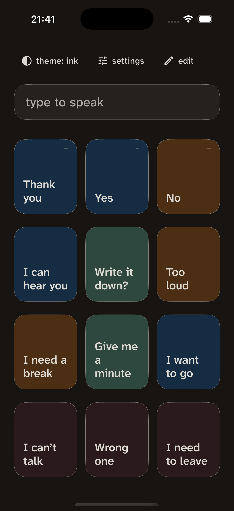

<div align="center">

<picture>
  <source media="(prefers-color-scheme: dark)" srcset="design/brand/reed-wordmark-dark.png">
  
</picture>

### Offline speech for when your voice comes and goes

A text-to-speech board for **part-time AAC** — built for autistic adults and teens whose speech is intermittent or unreliable.

[](https://github.com/zakariaf/Offline-AAC/actions/workflows/ci.yml)
[](LICENSE)


[Website](https://reed.applander.io) · [Privacy](https://reed.applander.io/privacy) · [FAQ / Support](https://reed.applander.io/support)

</div>

---

## What Reed is

Tap a phrase tile or type a sentence, and your phone speaks it aloud — or shows it full-screen in large type when sound won't work. One screen, one job. No account, no sign-up, nothing to set up before you use it.

Reed exists because every mainstream **symbol-grid** AAC app is built for young children — cartoon avatars, "parental" account gates, kiddie vocabulary — which is infantilising for the adults who need it, so they abandon it. Reed is the adult-first, calm, offline version: the vocabulary is yours, the design treats you as an adult, and there is no content filter on your own words.

> **AAC is not the backup plan; it is the plan.** Part-time use is the dominant, durable pattern for this population — not churn in progress. Reed protects the authoring path so the calm-state self can prepare phrases the crisis-state self can reach.

<div align="center">

</div>

## Who it's for

People whose speech is **intermittent** ("I can talk, but only sometimes"), **unreliable** (says things that don't match the intended meaning), or **insufficient** (fluent-sounding, still can't convey need) — most often autistic adults who go non-speaking during shutdown, overload, or exhaustion. The words used throughout are the field's own: *part-time AAC*, *unreliable speech*, *non-speaking* (not "non-verbal" — language is intact; only speech is unavailable).

## Features

- **Type to speak** — a sentence spoken aloud instantly. When speech doesn't play, your words go up on screen in large type, so you're still in the conversation.
- **A board you edit** — large phrase tiles you rewrite to your own words. No fixed vocabulary and no content filter. A tile's short label and the sentence it speaks are two separate fields.
- **Speak or show** — say a phrase aloud, or hold it up full-screen in a shop, a car, a waiting room.
- **Choose your voice** — the text-to-speech voices already on your phone, with pitch and speed. Voice is identity; Reed never imposes one.
- **Made for adults** — no cartoons, no student framing, no parental gate. Zero motion, warm calm palettes, one-handed reach.
- **Yours to keep** — free, no account, works with no signal. Nothing to log in to, and no server that can be shut down.

## Privacy

Reed's privacy claim is written to be **checked, not taken on trust**. (Full policy: [reed.applander.io/privacy](https://reed.applander.io/privacy).)

- **No INTERNET permission on Android.** Reed's Android build ships without it. The OS enforces this and it's listed on the Play page *before* install — you can verify the central claim without installing Reed or trusting this document. A store privacy label is developer-declared; the permission list is a fact the platform holds.
- **No accounts, no server, no analytics, no ads, no crash-reporting SDK.** The phrases you write stay on your device; there is no server to send them to.
- **Speech uses your device's own system TTS engine**, and Reed only selects voices that *declare* they need no network. That engine is a separate app with its own identity and permissions — Reed can't inspect or control it, so it filters on the declaration rather than claiming to verify it.
- **Cloud backup is off on Android** (`allowBackup="false"` + explicit `dataExtractionRules`), so your board isn't copied to Google Drive. Moving to a new phone is a user-initiated export.
- **iOS caveat:** iOS offers no equivalent OS-enforced network guarantee, and Apple documents `isExcludedFromBackup` as guidance, not a promise. On iOS the claim rests on Reed having no network code.

> Reed is a communication tool, **not a medical device**; it does not provide medical advice, diagnosis, or treatment. It is geo-restricted from the EU at launch (EU MDR Class I considerations for AAC software).

## Tech stack

Flutter (Dart 3), Android-first with iOS support. Deliberately small.

| Concern | Choice |
|---|---|
| Toolchain | Flutter **3.44.6** (pinned in [`.fvmrc`](.fvmrc); `fvm` optional) |
| State | `flutter_riverpod` 2.x — six plain providers, no codegen |
| Storage | `drift` (SQLite), device-only, `foreign_keys` on |
| Speech | `flutter_tts` behind a `SpeechService` seam, `.playback` audio session |
| Type | Atkinson Hyperlegible Next (variable), five fixed roles |
| Lints | `very_good_analysis`, promoted to errors, `riverpod_lint` |

Architecture is layer-first for data (`lib/data/`, `lib/native/`, `lib/model/`) and surface-first for UI (`lib/ui/board`, `show_text`, `edit`, `settings`, `core`), two levels deep, no barrels. Deep dives live in [`docs/`](docs/):

- [`docs/ARCHITECTURE.md`](docs/ARCHITECTURE.md) — layers, providers, the speech seam
- [`docs/DESIGN_SYSTEM.md`](docs/DESIGN_SYSTEM.md) · [`docs/DESIGN_RATIONALE.md`](docs/DESIGN_RATIONALE.md) — the four palettes, tile anatomy, zero-motion
- [`docs/CODING_STANDARDS.md`](docs/CODING_STANDARDS.md) · [`docs/TESTING.md`](docs/TESTING.md) · [`docs/TOOLING.md`](docs/TOOLING.md)
- [`docs/CHECKLIST.md`](docs/CHECKLIST.md) — the on-device pre-release pass
- [`.claude/skills/`](.claude/skills/) — the project's rules encoded as reviewable skills (colour, copy voice, privacy claims, speech, a11y…)
- [`epics/`](epics/) — the roadmap, E01–E11

## Getting started

```bash
# Flutter 3.44.6 (see .fvmrc). With fvm:  fvm install && fvm use
flutter pub get

# Generate drift + build_runner output (committed, but regenerate after schema edits)
dart run build_runner build --delete-conflicting-outputs

# Run on a connected device or simulator
flutter run

# The full suite — unit, widget, a11y, policy greps (~135 tests, <30s)
flutter test
```

> **Note:** the iOS *simulator* runs debug/profile only — iOS release builds are AOT-compiled for physical devices. Android supports `flutter run --release`.

## Project status

Reed is built in epics (see [`epics/`](epics/)). E01–E10 are complete (foundation, design system, data layer, speech, speak/show screens, edit mode, settings, portability, verification). **E11 (release)** is in progress: store paperwork and this public presence are done; signing, the obfuscation decision, and shipping to the first testers remain. Reed is not yet publicly downloadable — it's being tested with a small group first.

## Contributing

Contributions are welcome — especially from **people who use AAC**. See [`CONTRIBUTING.md`](CONTRIBUTING.md) for setup, the coding standards, and how decisions are made, and [`CODE_OF_CONDUCT.md`](CODE_OF_CONDUCT.md). Security reports: [`SECURITY.md`](SECURITY.md).

A note on positionality: the field's own guidance is that AAC users must be leaders and co-creators in anything about them, and names tokenism as a specific risk. This project does not claim lived experience it doesn't have. If you use AAC, your review carries weight here that a maintainer's cannot.

## License

[MIT](LICENSE) © 2026 Zakaria Fatahi.

Open-sourcing is Reed's **exit plan** — an offline, account-free app has no server to shut down, and publishing the source is how it survives its developer. It is *not* offered as evidence for the privacy claims: the OS-enforced absence of the INTERNET permission is, and that is verifiable without the source.

## Acknowledgements

- **Atkinson Hyperlegible Next** — Braille Institute, under the SIL Open Font License. (Developed and tested with low-vision readers; no independent peer-reviewed validation has been published.)
- **Flutter**, **drift**, **Riverpod**, **flutter_tts**, and the rest of the pub ecosystem — see [`pubspec.yaml`](pubspec.yaml).
- The autistic and AAC communities whose accounts shaped what Reed is and, just as much, what it refuses to be.
