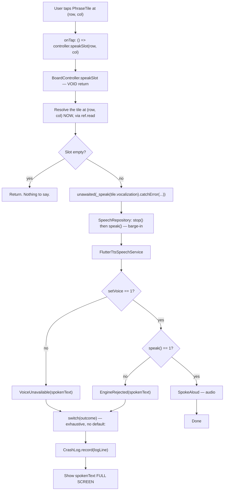
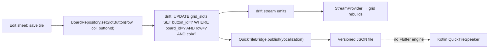

# Architecture

This is a one-screen app: a fixed grid of phrase tiles, a type-to-speak field, on-device TTS, an edit mode, and settings. Six tables. Roughly 25 source files. Two weeks, one developer.

That size is the single most important input to every decision below. The second most important is that **there is no telemetry and never will be** — so the compiler, the analyzer, and the test suite are the entire feedback loop. Nothing else will ever tell us the app failed. A user who cannot speak does not file a bug report.

This document is what goes where, and why. Where a widely-recommended practice does not earn its place here, it says so.

---

## 1. How much layering does this deserve?

Flutter's [official architecture guide](https://docs.flutter.dev/app-architecture) recommends MVVM with a UI layer (Views + ViewModels), a Data layer (Repositories + Services), and an optional domain layer. Its Strongly-recommend tier — layer separation, repository pattern, unidirectional data flow, immutable models, DI — carries no team-size condition, and the guide is explicit that it "was written for teams that have multiple developers contributing to the same code base." It invites adaptation but does not scope anyone out.

**The decision: adopt the shape, refuse the ceremony.**

Three layers, named the way the docs name them, because that costs nothing and a stranger inheriting this repo recognizes `data/` and `ui/` on sight. But every optional layer is refused, and the tree is **two directories deep, maximum**.

| Official guidance | Verdict here | Why |
|---|---|---|
| Data / UI layer split | **Adopt** | The one boundary that genuinely earns its keep — §4. |
| MVVM (View + ViewModel) | **Adopt, loosely** | A Riverpod `Notifier` *is* a ViewModel. The docs' case study [explicitly blesses the substitution](https://docs.flutter.dev/app-architecture/case-study). |
| "Views and view models 1:1" | **Reject** | One screen. The rule either produces a god object or is vacuous. It is a team-coordination device — it stops two devs fighting over one class. There is one dev. |
| Domain layer / use-cases | **Reject** | Rated *Conditional*; the docs say "in most apps they add unnecessary overhead," and [CRUD apps "might not need this optional layer"](https://docs.flutter.dev/app-architecture/case-study/domain-layer). Even the reference app has 2 use-cases across ~111 files. Every use-case here would wrap exactly one repository call. |
| Separate API + domain models | **Reject** | There is no API. Mapping a drift row to a mirror class maps a type onto itself. |
| Abstract repos with one impl | **Reject** | The docs justify these by dev/staging/remote environment swapping. There is one environment, no network, no auth. Abstract exactly what cannot run in a test (§4), nothing else. |
| `Command` pattern | **Reject entirely** | Its core is `if (_running) return;`. For a speak button, a re-tap means "say it again" — swallowing it is the silence bug. For an edit-mode DB write, a double-tap guard is `bool _saving`. Neither needs a `ChangeNotifier` subclass. |
| `package:provider` for DI | **Reject** | Riverpod already is a DI container, and overrides are the direct analogue. Two DI mechanisms is strictly worse than one. |
| `go_router` | **Reject** | Modes are state, not routes. The one thing go_router earns is deep linking, and the QS tile deliberately never launches Flutter (§4.3). |
| `freezed` | **Reject** | drift already generates `==`, `hashCode`, `copyWith`, `toString` for every row. A second generator producing overlapping output, plus a hand-written mapping layer, buys nothing. |
| Deep folders (`ui/board/view_models/`) | **Reject** | Four directory levels to reach the only view model in the app. Directories are free; **depth is a tax on every import**. Two levels. |

---

## 2. Feature-first vs layer-first

**Layer-first at the top (`data/`, `ui/`, `native/`); surface-first inside `ui/`.** This is the hybrid Flutter's [case study codifies](https://docs.flutter.dev/app-architecture/case-study): *"Data layer objects (repositories and services) aren't tied to a single feature, while UI layer objects (views and view models) are."*

The reasoning that matters is specific to this app, not an appeal to the docs:

**The four "features" — speak, show-text, edit, settings — are not features. They are four surfaces over one dataset.** All four read and write the same five tables. Under feature-first-by-screen, `AppDatabase`, `BoardRepository`, `SpeechService`, and `voice_filter` — nearly every non-widget file — land in a top-level `shared/`, leaving four thin folders of widgets. That is the exact "unbalanced structure" [Andrea Bizzotto describes as his own mistake](https://codewithandrea.com/articles/flutter-project-structure/): slicing by *page* rather than by domain.

Worth being honest about the counter-argument, because it is real: Bizzotto's actual recommendation is feature-first organized around **domain entities** — `boards/`, `buttons/`, `settings/` — not screens. That is a legitimate structure and it is not what he warns against. It is rejected here for a different reason: with six tables in one tightly-joined graph (a displayable tile is `grid_slots ⟕ buttons ⟕ images`), "the boards feature" and "the buttons feature" cannot be separated without a `shared/` for the join anyway. At this size the entity graph *is* the data layer.

---

## 3. The tree

Every directory earns its line.

```
offline_aac/
├── analysis_options.yaml     # 212 VGA rules + ~17 promoted to error. The other safety net.
├── build.yaml                # drift_dev `databases:` — required by make-migrations.
├── pubspec.yaml              # caret ranges; pubspec.lock is COMMITTED (it's an app).
├── README.md                 # run it, the 4 counterintuitive decisions, non-goals.
├── docs/
│   ├── ARCHITECTURE.md       # this file
│   └── CHECKLIST.md          # the manual device pass. Emulators have no TTS engine,
│                             # so this is the only thing that verifies audio exists.
├── drift_schemas/            # COMMITTED. One JSON per historical schema version.
│   └── app_database/         # Makes schema deltas a reviewable diff. Generated by
│                             # make-migrations; drift's default dir name.
├── lib/
│   ├── main.dart             # error handlers, DB open, ProviderScope, runApp. ~40 lines.
│   ├── data/                 # BY TYPE — every surface uses all of it.
│   │   ├── database/
│   │   │   ├── app_database.dart      # @DriftDatabase, schemaVersion, MigrationStrategy
│   │   │   ├── app_database.g.dart    # COMMITTED — see §3.1
│   │   │   ├── tables.dart            # boards buttons grid_slots images sounds settings
│   │   │   ├── schema_versions.dart   # generated stepByStep helper
│   │   │   ├── connection.dart        # getApplicationSupportDirectory, NOT documents
│   │   │   └── backup.dart            # copy .sqlite before onUpgrade. ~15 lines.
│   │   │                              # Higher safety-per-line than every migration test.
│   │   ├── board_repository.dart      # the ONLY thing UI may ask about boards
│   │   ├── settings_repository.dart
│   │   ├── speech/
│   │   │   ├── speech_service.dart        # ABSTRACT + sealed SpeakOutcome. The seam.
│   │   │   ├── flutter_tts_speech_service.dart  # the one real impl. Thin. Untestable.
│   │   │   ├── voice_filter.dart          # PURE. No plugin import. 100% covered.
│   │   │   └── audio_session_config.dart  # .playback, NEVER .ambient.
│   │   ├── media_store.dart      # image import: downscale to ≤512px AT IMPORT.
│   │   ├── crash_log.dart        # on-device, exportable. The only field signal, ever.
│   │   └── seed/
│   │       └── starter_phrases.dart  # const Dart list, NOT a JSON asset — a missed
│   │                                 # pubspec entry makes first launch an empty board.
│   ├── native/               # EVERY MethodChannel. Nothing else may create one.
│   │   ├── personal_voice_channel.dart  # iOS only. ~1 method. Progressive enhancement.
│   │   └── quick_tile_bridge.dart       # SOLE writer of the QS-tile contract file.
│   ├── model/
│   │   ├── board_grid.dart   # the 2 types drift cannot generate: a joined Tile, and a
│   │   └── speak_outcome.dart # per-board-dimensioned grid. Plus the sealed TTS outcome.
│   └── ui/                   # BY SURFACE — thin on purpose. The weight is in data/.
│       ├── app.dart
│       ├── board/
│       │   ├── board_screen.dart
│       │   ├── board_controller.dart      # the ViewModel. Riverpod Notifier.
│       │   ├── phrase_tile.dart
│       │   └── compose_field.dart
│       ├── show_text/show_text_screen.dart
│       ├── edit/edit_screen.dart
│       ├── settings/settings_screen.dart
│       └── core/
│           └── tokens.dart   # tap-target floor, contrast pairs. No magic numbers.
├── test/                     # mirrors lib/ 1:1 — "what has no test?" is a diff of two ls
├── integration_test/         # 3 tests. The QS-tile contract round-trip lives here (§4.3).
└── android/app/src/main/kotlin/.../
    ├── QuickPhraseTileService.kt   # ~5 lines. Delegates immediately.
    ├── QuickTileSpeaker.kt         # the real logic. Plain JUnit tests it.
    └── QuickTileContract.kt        # mirrors quick_tile_bridge.dart BY HAND.
```

**Deliberately absent:** `lib/src/` (a package convention; an app has no external importers), barrel files (measurable analyzer cost, circular-import risk, zero benefit at 25 files), `lib/utils/` (junk drawer), `lib/domain/use_cases/`, `lib/routing/`, `packages/` + melos (nothing to multiply), `main_dev/staging/prod` (no environments), `lib/l10n/` (~25 chrome strings — revisit before open-sourcing).

### 3.1 Generated code is committed

`.g.dart` files are in git, with `*.g.dart linguist-generated=true` in `.gitattributes` so GitHub collapses them in diffs.

The usual objection is merge conflicts — void for a solo dev. The arguments *for* are specific: a stranger's `git clone && flutter run` must work with no `build_runner` round-trip, and **drift's generated code is the schema**, so a migration PR shows the actual schema delta as a reviewable artifact rather than a leap of faith. In 2029, `dart run build_runner build` against a stale pubspec may simply not resolve; the committed output still compiles.

The staleness risk is fully mitigated by one CI step: `dart run build_runner build --delete-conflicting-outputs && git diff --exit-code`.

---

## 4. The three load-bearing boundaries

Most boundaries in this app are decoration. These three are not.

### 4.1 `SpeechService` — an interface, because the platform cannot run in a test

```dart
// lib/data/speech/speech_service.dart
abstract interface class SpeechService {
  /// Barge-in: internally stops any in-flight utterance first. A re-tap means
  /// "say it again" / "I need this NOW" — never swallow it.
  @useResult
  Future<SpeakOutcome> speak(String text);

  Future<void> stop();
  Future<List<Voice>> voices();
}
```

Two reasons this interface exists, and only two:

1. **It cannot run in `flutter test`.** Everything else in `data/` can. This is the whole rule for what gets abstracted: *abstract exactly what you cannot execute in a test.* One interface, one real impl, one fake — justified. One interface with one impl — not.
2. **`flutter_tts` is a bus-factor-1 MIT package.** It is healthy today (~285k weekly downloads), but the day it stops being healthy, this interface is what makes vendoring it a one-file change instead of a refactor. That is not hypothetical hedging — it is why the interface is worth the 8 lines.

The real impl is **as thin as possible**. Everything testable lives one layer up: `voice_filter` (a pure function over the raw voice list) and the `setVoice` return check. This is Google's own split — Services "wrap API endpoints… hold no state"; the transformation and error handling belong above them. It is also simply where the bugs are.

`voice_filter` deserves naming as a component rather than a helper, because four separate wire-format traps live in it, each of which **silently inverts the safety property in the direction that hurts**:

- Android sends `network_required` as the **string** `"1"`/`"0"`. `raw['network_required'] == true` is always `false` (String vs bool), and `"0"` is non-empty so it survives truthiness checks.
- `features` is **TAB-separated**.
- iOS **omits** `network_required` entirely — absent must mean not-network-required.
- A voice with the `notInstalled` feature makes `setVoice` return **1 (success)** and then synthesizes silence or substitutes a different voice. **The return-value check does not catch this.** Filter on the feature.

None of that requires a device. All of it is 100%-covered pure Dart.

### 4.2 The repository seam — the UI never imports drift

`BoardRepository` is the only thing the UI may ask about boards. No widget imports `package:drift`.

Be honest about what this buys, because it is not what the pattern usually claims. It is not swappable storage — there will never be a second implementation. It is:

- **A test seam.** One Riverpod override swaps the whole board layer.
- **A place for the join.** drift generates a row class per table and **never per join**. A displayable tile is `grid_slots ⟕ buttons ⟕ images` with two nullable FKs. Somebody has to unpack `List<TypedResult>` via `readTable()`/`readTableOrNull()`, and it must not be a widget.
- **A place for `BoardGrid`.** The materialized grid — dimensions × nullable tiles — is a shape the schema deliberately does not have (§8).

`BoardRepository` is **concrete**. No interface. It is tested against real in-memory SQLite (`NativeDatabase.memory()` — actual sqlite3, not a fake). This is a deliberate departure from Google's Strongly-recommend "[make fakes for testing](https://docs.flutter.dev/app-architecture/recommendations)": a Map-backed fake happily accepts a row the real `PRIMARY KEY (board_id, row, col)` rejects, and never executes a migration step. Google's advice assumes the real dependency is a network. Here it is SQLite, which runs fine in a test — and a migration bug is the loss of someone's voice, which outranks the recommendation.

### 4.3 The native boundary — the QS tile is a parallel app

**This is an architectural fact, not an implementation detail.**

The Android Quick Settings tile does **not** start a Flutter engine. `QuickPhraseTileService.onClick()` reads a phrase from shared storage and calls Android's `TextToSpeech` directly. It is the fastest path to speech in the product — it skips FlutterActivity, engine init, Dart VM snapshot load, drift open, and first frame.

Three consequences follow, and all three are structural:

**(a) No Flutter test of any level can reach it.** Not unit, not widget, not `integration_test`. State that plainly. This is the crisis path and it has zero Dart-side coverage. Mitigation: `onClick()` is ~5 lines delegating to a plain Kotlin class (read → validate non-empty → speak) that plain JUnit tests with a fake TTS. No Robolectric — `TileService` is lifecycled by SystemUI and has no first-class shadow.

**(b) The shared-storage format is a cross-language contract with zero compiler enforcement.** It gets exactly one owner per side: `lib/native/quick_tile_bridge.dart` and `QuickTileContract.kt`. Rename a key in one without the other and the tile speaks nothing — in the one code path the user reaches mid-shutdown.

**(c) It is a versioned JSON file, not `shared_preferences`.** This overrides the original plan, for a verified reason. Current `shared_preferences` has two independent traps: `SharedPreferencesAsync` is backed by **Jetpack DataStore**, not `FlutterSharedPreferences.xml`, so Kotlin's `getSharedPreferences(...)` reads *nothing*; and the legacy API prefixes every key with `flutter.`, so `getString("phrase")` returns null — the key is `flutter.phrase`. Owning an explicit file with a schema version sidesteps both, survives a `shared_preferences` major, and is readable by a stranger.

> **The obvious test for this does not work.** `SharedPreferences.setMockInitialValues` is in-memory only. A Dart unit test asserting "edit a tile → the stored value changed" asserts *a fake mutated a fake* — green while the Kotlin read path is broken. That is manufactured false confidence in precisely the silent failure it claims to guard. **The mirror invariant requires an `integration_test`** that writes from Dart and reads back through the real native path.

The iOS 18 `ControlWidget` is the same shape: a Swift app-extension target, App Group storage, no Dart. Only **Personal Voice** is genuinely channel-shaped — one method, `requestPersonalVoiceAuthorization` — and it is strictly progressive enhancement, never a dependency.

---

## 5. Data flow

### Tile tap → audio out



Three things in that diagram are load-bearing and non-obvious:

**`speakSlot` returns `void`.** Verified on this machine's toolchain: `onTap: () => tts.speak('x')` is flagged by **neither** `discarded_futures` nor `unawaited_futures` — the arrow closure "returns" the Future, so the lint considers it handled, but the target type is `VoidCallback`, so the Future *and its error* are dropped. This is the most idiomatic way to wire a Flutter tile and it is exactly the silence bug. No lint in the ecosystem catches it. The fix is structural: a void-returning controller method that internally does `unawaited(_speak(p).catchError(...))`. A callback then never holds a Future and **the hole is unreachable by construction**.

**The tile is resolved at tap time, not captured in `build()`.** Capturing a `ref.watch` value into an `onTap` closure means a rapid double-tap can speak the *previous* tile's vocalization — the wrong sentence, out loud, to a stranger, on behalf of someone who cannot correct it verbally. The schema makes the fix free: position is the primary key, so `(row, col)` can never go stale.

**Every failure ends at "show the text."** Not a toast, not a log line — the full sentence on screen. That is the whole point: when audio does not happen, the words must.

### Edit → DB



No optimistic state. It exists to hide network latency; a local SQLite write is single-digit milliseconds, so the revert path could never fire and is pure liability. It would also violate the zero-animation rule — a state that appears and then reverts is a visual change the user did not cause.

Note the fan-out at `C`: **every board edit must republish the QS-tile file.** A stale mirror means the tile speaks a phrase the user deleted months ago. That write-through is not an optimization; it is the correctness of the crisis path.

---

## 6. State management

Riverpod 3 (`flutter_riverpod 3.3.2`). **It is not load-bearing and the docs should not pretend otherwise.** For 12 tiles and a text field, `ValueNotifier` + constructor injection would work, would cost a day less, and would arguably read more plainly to a stranger.

Of the three original justifications, only one survives:

| Justification | Verdict |
|---|---|
| A testable repository↔UI seam | **Holds.** Override-based DI is one line per fake. |
| Reacting to MediaQuery a11y flags | **Withdrawn.** See below. |
| Reacting to TTS voice-availability | **Weak.** Real, but a `StreamBuilder` does it. |

It stays because it is decided, it costs ~2 hours, and re-litigating costs more than that. **But it is only cheap if it stays minimal.** Riverpod's cost curve is not in adoption — it is in the family/scoping/codegen/generated-lint stack. Six plain providers. No families, no scoping, no `@riverpod`, no codegen. The moment `family` is typed, the argument that it was cheap has been lost.

**MediaQuery accessibility flags do not go through Riverpod.** Read `MediaQuery.textScalerOf(context)` / `boldTextOf(context)` at build time, in the widget. `MediaQuery` is already an `InheritedWidget` — already a reactive propagation mechanism with correct-by-construction invalidation. Routing it through a provider means either `BuildContext` inside a provider or a manual push-and-sync that is stale for one frame. For `TextScaler` at 200%+, where being wrong is total failure rather than a cosmetic bug, trading a compiler-guaranteed rebuild for a manual sync is a strictly bad trade. **App state via Riverpod; platform/a11y state via `BuildContext`.**

```dart
Future<void> main() async {
  WidgetsFlutterBinding.ensureInitialized();
  // ... error handlers, DB open — see §11

  runApp(
    ProviderScope(
      // Riverpod 3 retries failing providers BY DEFAULT: 200ms doubling to a
      // 6.4s ceiling, bounded at maxRetries = 10 (~38s of added delay).
      // It skips `Error` subclasses — but SqliteException is an Exception, so a
      // corrupt DB is retried for ~38 seconds behind a spinner.
      //
      // This app has no network. A throwing provider means a corrupt DB or a
      // missing file on disk — a real bug that must be LOUD, on a device that
      // will never send us a crash report. Fail immediately.
      //
      // `Retry` is `Duration? Function(int retryCount, Object error)`;
      // returning null disables. [VERIFIED against riverpod 3.3.2 source]
      retry: (retryCount, error) => null,
      overrides: [
        databaseProvider.overrideWithValue(db),
        speechServiceProvider.overrideWithValue(speech),
      ],
      child: const AacApp(),
    ),
  );
}

// The two seams. Throwing by default is deliberate: an un-overridden seam fails
// at first read with a clear message instead of silently constructing a real
// TTS engine inside a unit test.
final databaseProvider = Provider<AppDatabase>(
  (ref) => throw UnimplementedError('databaseProvider must be overridden'),
);
final speechServiceProvider = Provider<SpeechService>(
  (ref) => throw UnimplementedError('speechServiceProvider must be overridden'),
);

final boardRepositoryProvider =
    Provider<BoardRepository>((ref) => BoardRepository(ref.watch(databaseProvider)));

// isAutoDispose defaults to FALSE for hand-written providers (codegen defaults it
// to TRUE — the asymmetry that bites). False is right: the grid IS the app.
final gridProvider = StreamProvider<BoardGrid>(
  (ref) => ref.watch(boardRepositoryProvider).watchGrid(kDefaultBoardId),
);
```

Two corrections to advice that circulates widely, both verified against the installed `riverpod 3.3.2`:

- **Notifiers are preserved across rebuilds.** The "recreated on every rebuild → holding a controller as a field leaks" claim describes a dev-cycle change that was reverted before stable (`CHANGELOG` line 139: *"Revert Notifier life-cycle change. They are once again preserved across rebuilds."*). Keeping `SpeechService` in a plain `Provider` with `ref.onDispose` is still the right pattern — on ordinary lifecycle grounds, not because a breaking change forces it.
- **`.autoDispose` still exists** and still compiles. Only the interface clones (`AutoDisposeRef`, `AutoDisposeNotifier`) were removed. `Provider(create, isAutoDispose: true)` is the current spelling; migrating is cosmetic, not mechanical.

In tests: `ProviderContainer.test(overrides: [...])` — it self-disposes. Do **not** write a `createContainer` helper or `addTearDown(container.dispose)`; that pattern is in nearly every Riverpod article from 2022–2024 and is obsolete. The override method is **`overrideWithValue`** (there is no `overrideValue`).

---

## 7. Error handling

**One error type. Not two.**

Flutter's guide publishes a sealed `Result<T>`, and the corpus originally proposed carrying it for the drift repository alongside a separate outcome type for speech. That is rejected. Two error vocabularies in a 25-file app is cost with no payoff — and `Result<T>`'s error arm is typed `Exception`, which gives zero exhaustiveness, so it cannot force handling of a *new* failure mode, which was the entire stated goal.

**Drift throws.** Catch it at the repository boundary and at the three UI call sites that care. That is what exceptions are for.

**`speak()` returns a sealed `SpeakOutcome`** whose failure variants **carry the text that must be shown**:

```dart
// lib/model/speak_outcome.dart
@immutable
sealed class SpeakOutcome {
  const SpeakOutcome();
}

final class SpokeAloud extends SpeakOutcome {
  const SpokeAloud();
}

/// The phrase was NOT spoken. The caller MUST show [spokenText] instead.
@immutable
sealed class SpeakFailure extends SpeakOutcome {
  const SpeakFailure(this.spokenText);

  /// The on-screen fallback. Present on every failure, by construction —
  /// which makes "show the words" a total function of the outcome.
  final String spokenText;

  /// For the crash log. Never shown to the user.
  String get logLine;
}

final class NoVoiceSelected extends SpeakFailure {
  const NoVoiceSelected(super.spokenText);
  @override
  String get logLine => 'no voice selected in settings';
}

/// setVoice did not return 1. flutter_tts writes a Log.d and returns 0 —
/// it does NOT throw. Unchecked, this is total, silent speech loss.
final class VoiceUnavailable extends SpeakFailure {
  const VoiceUnavailable(super.spokenText, {required this.voiceName});
  final String voiceName;
  @override
  String get logLine => 'setVoice rejected "$voiceName"';
}

final class EngineRejected extends SpeakFailure {
  const EngineRejected(super.spokenText, {required this.code});
  final Object? code;
  @override
  String get logLine => 'engine rejected speak(), code=$code';
}
```

**Be precise about what this buys.** Three separate mechanisms, only one of which is a compiler guarantee:

1. **A non-exhaustive switch over a sealed type is a compile error** — `non_exhaustive_switch_statement` is `type: compileTimeError` in the analyzer's `messages.yaml`, not a lint. Widespread claims that it is "just a warning" are wrong. So adding a `SpeakFailure` variant breaks the build at every call site — **provided no `default:` or `case _:` is ever written.** Writing one silently disables the only alarm system this app has.
2. **Exhaustiveness does not force the caller to switch at all.** `await speak(text);` discarding the outcome compiles clean. That hole is closed by `@useResult` from `package:meta` plus `unused_result: error` in `analysis_options.yaml` — an *analyzer* diagnostic promoted to error, which is only as strong as CI treating it as blocking.
3. **Nothing in the type system detects `setVoice` returning 0.** That check is hand-written, at the plugin boundary. Sealed types only guarantee the failure *propagates* once detected. The detection gap is the root cause and no type discipline closes it.

The honest guarantee is *"compile error on a new variant, analyzer error on a discarded outcome, hand-written detection at the wire."* Not "silence is impossible."

### Errors reach disk, because there is nowhere else

```dart
void main() async {
  // Same function body as runApp(): no zone, so no zone-mismatch warning.
  WidgetsFlutterBinding.ensureInitialized();
  final log = await CrashLog.open();

  // Errors inside Flutter's build/layout/paint callbacks.
  FlutterError.onError = (details) {
    FlutterError.presentError(details);
    log.record(details.exceptionAsString(), details.stack);
  };

  // Uncaught async errors outside the framework's callbacks.
  PlatformDispatcher.instance.onError = (error, stack) {
    try {
      log.record(error.toString(), stack);
      if (kDebugMode) debugPrint('$error\n$stack');
    } catch (_) {
      // Never let the error handler throw.
    }
    return true; // ALWAYS true. See below.
  };

  runApp(/* ... */);
}
```

**No `runZonedGuarded`.** Sources conflict; the official doc decides it. [docs.flutter.dev/testing/errors](https://docs.flutter.dev/testing/errors) shows exactly these two handlers and never mentions zones, and the [zone-errors breaking-change doc](https://docs.flutter.dev/release/breaking-changes/zone-errors) says the fix for the zone-mismatch warning is *to remove zones from the application*. The "you need all three handlers" advice is **crash-SDK advice** — Sentry needs a zone because it wraps its own init. There is no SDK here, so the zone buys nothing and costs a documented footgun.

**Return `true` unconditionally, and `debugPrint` in debug.** [`api.flutter.dev`](https://api.flutter.dev/flutter/dart-ui/PlatformDispatcher/onError.html) warns the `false` path routes to the embedder's fallback and "the VM or the process may exit or become unresponsive." `return kReleaseMode` buys debug console visibility at the cost of the one behaviour a crisis UI cannot tolerate — and buys it unnecessarily, since `debugPrint` gives the same visibility for free.

`CrashLog.record` is **synchronous** (so an entry survives a hard kill), **size-bounded** (nothing is watching the disk fill), and **incapable of throwing**. Its bare `catch (_)` deliberately violates Effective Dart's *"DON'T discard errors"* rule, and the comment explaining why is load-bearing — without it, someone "fixes" it into infinite recursion inside the error handler.

Also: **unwrap `ProviderException` before logging.** Riverpod 3 rethrows provider failures wrapped. An unwrapped log records the wrapper, not the cause — and every entry reads `ProviderException`, destroying the one diagnostic that exists.

---

## 8. The data model

Six tables, borrowing [Open Board Format](https://www.openaac.org/docs.html) semantics. The full column list is in `lib/data/database/tables.dart`. Three things here are architecture, not schema.

### `label` ≠ `vocalization` ≠ `display_text`

The tile **shows** "Overwhelmed". It **speaks** "I need to leave, I'm not able to talk right now". Show-text mode may render a third string. Nothing in the type system distinguishes three `String`s, and getting them backwards means a screen-reader user hears a paragraph on every scan step, or a stranger hears the wrong sentence. Adopt on day one — retrofitting after users have customised boards is a painful migration.

### `grid_slots`: position IS the primary key

```dart
/// Position is not an attribute of a tile. Position is the IDENTITY of the slot.
///
/// PRIMARY KEY (board_id, row, col) with a NULLABLE button_id.
/// An empty cell is a row with button_id IS NULL — not an absent row.
///
/// WHY THIS LOOKS LIKE A NORMALIZATION MISTAKE AND ISN'T:
/// Position-based muscle memory is the retrieval channel most likely to survive
/// a shutdown. A tile that MOVES is worse than a tile that is missing — the user
/// presses it and says the wrong thing at the worst possible moment. Every
/// ordered-list schema eventually reflows: a delete shifts everything up, and you
/// then defend against it with application logic that is one forgotten WHERE
/// clause from failing silently.
///
/// With position as the key there is no ordering to recompute, so reflow is not
/// prevented — it is UNREPRESENTABLE. This turns a product rule into a structural
/// property, which is the only kind that survives 2am.
///
/// If you are reading this because you were about to add a surrogate `id` and an
/// `order` column: that permits two rows claiming the same (row, col) and
/// reintroduces the exact failure this schema exists to prevent. No test and no
/// crash report will tell you — the bug manifests only as a real person saying
/// the wrong sentence out loud.
class GridSlots extends Table {
  IntColumn get boardId => integer().references(Boards, #id, onDelete: KeyAction.cascade)();

  // `row` is a SQLite keyword and these columns are the PK. Zero cost to name
  // them now; renaming a PK column later is a TableMigration against live data.
  IntColumn get rowIndex => integer().named('row_index')();
  IntColumn get colIndex => integer().named('col_index')();

  // NULLABLE + SET NULL: deleting a button empties its slot and cannot shift a
  // neighbour, because a neighbour's identity is its coordinates.
  // This depends ENTIRELY on PRAGMA foreign_keys = ON. See §8.1.
  IntColumn get buttonId =>
      integer().nullable().references(Buttons, #id, onDelete: KeyAction.setNull)();

  @override
  Set<Column> get primaryKey => {boardId, rowIndex, colIndex};
}
```

`autoIncrement()` implies `PRIMARY KEY` and will not compile alongside a `primaryKey` override. **That compile error is the architecture defending itself. Do not work around it.**

**The grid is NOT hardcoded 3×4.** `boards.grid_rows` and `boards.grid_cols` are real columns, settings carries a `grid_size` key, and the design research requires a **2×3 "crisis/large" layout** (~180dp tiles) alongside the 3×4 phone default. Any `const kRows = 4` or `CHECK (row_index < 4 AND col_index < 3)` would make the 2×3 layout a database-level insert failure — baked into the primary key's own table, i.e. exactly the migration you do not want at v2. Bounds come from the board row and are enforced in `BoardRepository`, not in a `CHECK` (SQLite `CHECK` cannot reference another table anyway).

`BoardGrid` and the joined `Tile` are the **only two hand-written model types**, because drift generates a class per table and never per join, and because a materialized `rows × cols` grid of `Tile?` is a shape the schema deliberately does not have.

### 8.1 Foreign keys are OFF by default

SQLite does not enforce foreign keys unless told to, **per connection, on every open**, and drift does not do it for you.

This is the load-bearing footgun for this schema. With FKs off, `onDelete: KeyAction.setNull` is **silently ignored** — SQLite does not error, it does nothing. `button_id` keeps pointing at a deleted row, and the tile renders blank or throws on join. That is the silent-failure class, in the data layer, with no telemetry to report it.

So: `PRAGMA foreign_keys = ON` **unconditionally** in `beforeOpen` — not inside `if (details.wasCreated)`, which is correct for *seeding* and catastrophically wrong for a per-connection pragma. Plus a test asserting `PRAGMA foreign_keys` returns `1`, and a behavioural test asserting that deleting a button nulls its slot and moves nothing. The two are a pair: the second tells you it broke, the first tells you why.

During migration, the pragma must be toggled **outside any transaction** — it is a [silent no-op while a `BEGIN`/`SAVEPOINT` is pending](https://sqlite.org/pragma.html#pragma_foreign_keys) — with `PRAGMA foreign_key_check` afterwards to prove nothing was corrupted while enforcement was off.

### 8.2 Migrations

`build.yaml` declares the database; `dart run drift_dev make-migrations` emits schema JSONs, the `stepByStep` helper, and migration tests in one command. Defaults are already right (`schema_dir: drift_schemas`, `test_dir: test/drift`), so only `databases:` needs declaring.

```yaml
targets:
  $default:
    builders:
      drift_dev:
        options:
          databases:
            app_database: lib/data/database/app_database.dart
```

Three architectural notes:

- **Do this at commit #1**, before there is any user data to lose. The day-one obligation is the *schema dump*, not the tests — at `schemaVersion = 1` there are no migrations to test, and the v1→v2 test cannot be written until v2 exists.
- **`migrateAndValidate` is blind to rows.** It extracts `CREATE` statements from `sqlite_schema` and compares shapes. A migration that rebuilds `grid_slots` perfectly and copies **zero rows** passes it, green. Data survival requires `verifier.schemaAt(n)` + `--data-classes --companions`. drift's own docs say it: *"If you want to insert data in a migration test, use `schemaAt`."*
- **`backup.dart` outranks all of it.** Copy the `.sqlite` file before `onUpgrade` runs, keep the last two, expose "Restore previous board." ~15 lines. Migration tests protect against bugs you enumerated; the backup protects against the migration bug you did **not** — which, with no telemetry, is the entire invisible category. It is the highest safety-per-line item in the project and it is not a test at all.

---

## 9. Where the data lives — and the backup question

`getApplicationSupportDirectory()`, not `getApplicationDocumentsDirectory()`. Backed up like Documents, but not user-visible in Files — correct for an internal DB.

**And that raises a question no dimension of the research answered, which must be decided before v1 rather than discovered by a user.**

`android:allowBackup` defaults to **true**. With no code written, the SQLite database — including every vocalization, i.e. the most intimate content the user owns — is uploaded to Google Drive. iOS is the same story via iCloud. The privacy label says "no network, no server." The manifest says otherwise, and an audience that reads privacy labels adversarially **will** find this.

It is a genuine dilemma, not just a bug: the boards are irreplaceable and unmergeable, and auto-backup is the only thing that would save them when a user loses their phone.

**Decision: `allowBackup="false"` plus explicit `dataExtractionRules`, and a user-initiated export in settings.** The privacy promise is the product; a durability feature the user did not ask for and cannot see is not a trade this app gets to make on their behalf. Durability is served by making export obvious, and by `backup.dart` covering the migration case — which is the failure mode the developer actually causes.

Related and unresolved: **the crash log is a privacy artifact.** It is user-exportable and `CrashLog.record(message, stack)` will happily capture vocalization text. A user exporting a log to a maintainer could leak "I need to leave, I'm not able to talk right now" plus whatever they typed. It needs a redaction rule and a test. **This is not designed yet.**

---

## 10. What is deliberately not abstracted

Naming these matters, because each looks like an omission and each is a decision.

| Not abstracted | Why |
|---|---|
| **`BoardRepository`** — concrete, no interface | The only reason to abstract is a test seam, and this one runs against real in-memory SQLite. A fake would defeat the migration testing that makes the abstraction pointless in the first place. |
| **`AppDatabase`** — no DAO interface | drift's generated API *is* the interface. Wrapping it in another one adds a layer whose only content is the word "repository." |
| **Settings** — no `SettingsService` | It is a key/value read from a table. `SettingsRepository` is already generous. |
| **Navigation** — no router | Four destinations, no deep links, no web surface, zero animation. `Navigator.push` or a state flag. |
| **Theme** — no theming abstraction | One `ThemeData` + `tokens.dart`. |
| **`CrashLog`** — concrete | If the logger needs a test double, the logger is too complicated to be a logger. |
| **The QS tile** — not a plugin, not federated | [Federation exists](https://docs.flutter.dev/platform-integration/platform-channels) so a domain expert can extend someone else's published plugin. One dev owns all of this, and the tile has no Dart at all. A plugin adds a platform_interface, version lockstep, and a publishing story in exchange for nothing. |

The rule underneath all of it: **abstract exactly what cannot run in a test.** That is `SpeechService` and the Personal Voice channel. Everything else executes in `flutter test` and an interface over it is a layer to read past.

---

## 11. Startup

```
Android process fork (zygote) ─┐
Application.onCreate           ├─ Android's. Not ours. Not measurable from Dart.
libflutter.so load             ┘
    ↓
main()
    ↓  WidgetsFlutterBinding.ensureInitialized()
    ↓  CrashLog.open()                 — must be first; a crash before this is invisible
    ↓  FlutterError.onError = ...      — cheap, synchronous
    ↓  PlatformDispatcher.onError = ...
    ↓  AppDatabase open + migration    — the ONLY plausible blocker. See below.
    ↓  audio_session config (.playback)
    ↓  runApp(ProviderScope(...))
    ↓
FIRST FRAME — grid visible and tappable
    ↓
addPostFrameCallback:
    ↓  SpeechService.warmUp()          — NOT awaited, NEVER blocks the frame
    ↓  voice_filter → resolve stored voice, fall back audibly if it vanished
```

**Latency budget.** Android vitals treats a cold start of ≥5s as excessive, and startup is not a core vital — it cannot affect discoverability. A one-screen app with no plugin work in `main()` and a 12-row read lands well inside that. **There is nothing to optimise here and cold-start micro-optimisation is not a good use of two weeks.** The only rule is: *do not block the first frame.*

Two things deserve real attention, and neither is Flutter's:

**The DB open is the one plausible Flutter-side blocker — via migration.** Reading 12 rows is sub-10ms and safe to await. A migration over a hand-curated board on first launch after an update is unbounded work sitting between the user and their voice. The rule is not "make migration fast"; it is *show the grid shell immediately rather than a blank window while migrating*, and never put a migration on the QS-tile speech path — which the no-Flutter-engine design already guarantees structurally.

**TTS engine binding is a real, separate cost that Flutter profiling does not surface.** [`flutter_tts` PR #594](https://github.com/dlutton/flutter_tts) documents binder IPC and voice deserialization running **synchronously on the main thread** inside `OnInitListener`, producing ANRs on the cold-start path. Warm it from `addPostFrameCallback` so the cost is paid while the user is looking at an already-usable grid. Warm-up is **best-effort and fails silently**; `speak()` fails **loudly**. Those are opposite error policies on the same service, and that asymmetry is deliberate.

And one manifest line that outranks everything else in this section:

```xml
<!-- Without this, Android 11+ package visibility HIDES the TTS engine.
     flutter_tts returns an empty voice list with only a Log.d. Every Android 11+
     user gets a board that cannot speak, and we will never hear about it. -->
<queries>
  <intent><action android:name="android.intent.action.TTS_SERVICE" /></intent>
</queries>
```

A test can read the manifest file and assert that string is present. It should.

---

## 12. Open

Honest list. These are decided nowhere yet:

- **Crash-log redaction** (§9). Needs a rule and a test.
- **Locale → voice selection.** If a user's device is `fr-FR` and their phrases are English, filtering voices by device locale removes every working voice — a total-silence path.
- **Cross-process audio arbitration.** The QS tile and the Flutter app are two TTS clients. Nothing decides what barge-in means across them.
- **Compose-field durability.** If the app is killed mid-typing, is the typed phrase lost? For someone in shutdown, retyping is extremely expensive.
- **OBF import/export.** The only place untrusted input enters the app, and it has no design.

---

## Reading order for a stranger

1. `lib/data/database/tables.dart` — the doc comment on `GridSlots` explains why the schema looks wrong and isn't.
2. `lib/data/speech/speech_service.dart` — the sealed `SpeakOutcome` is the app's whole theory of failure.
3. `lib/ui/board/board_controller.dart` — why `speakNow` returns `void`.
4. `docs/CHECKLIST.md` — what "working" means, since no machine can verify it.

If you are about to "clean up" a nullable FK inside a composite primary key, an audio session pinned to `.playback`, a `setVoice` return check that reads as paranoia, or a `void` return that looks like a mistake — each of those is load-bearing, each has a comment at the point of temptation, and **no test and no crash report will tell you when you have broken it.**
